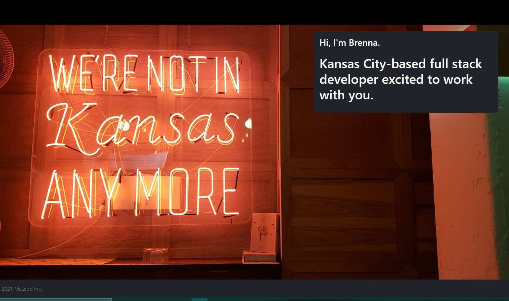
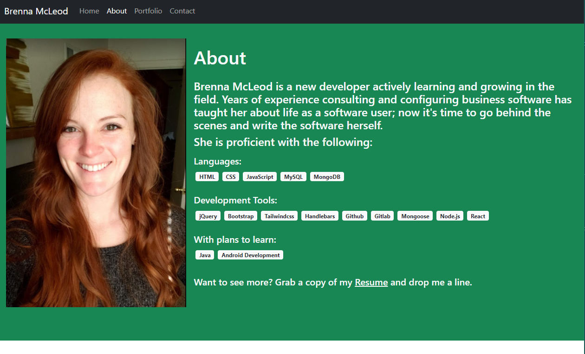
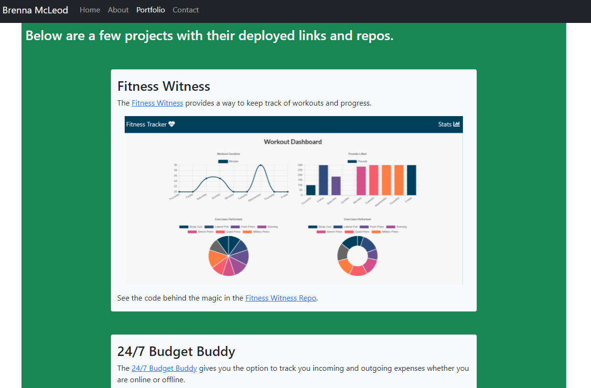
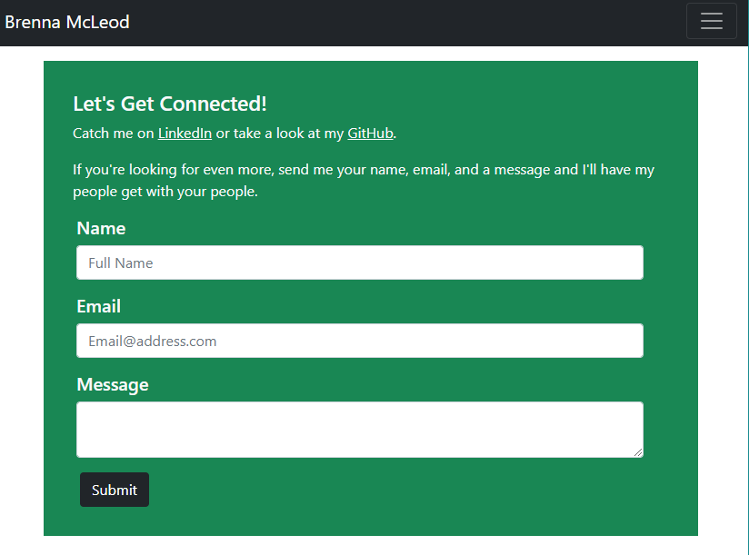
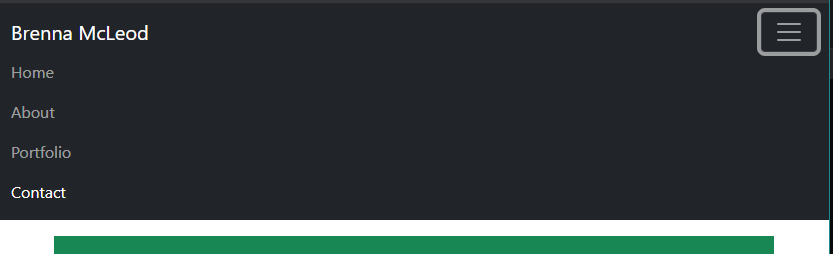

# McLeod Portfolio

A React version of the original portfolio: https://bmcleod12.github.io/mcleod-react-portfolio/#/

## Walkthrough

Open the webpage to poke around: https://bmcleod12.github.io/mcleod-react-portfolio/#/

The Home page displays a cover photo.

The About page features a brief introduction and a list of proficiencies, as well as a link to download my resume.

The Portfolio page features projects completed during the KU Coding Bootcamp.

The Contact page features forms that (one day) enable you to send an email to me. Notice in this view the browser size has been reduced to display the hamburger menu.

When viewing this page on mobile, the navigation links appear as follows:

## Technologies

This application uses:
* Bootstrap
* React

## Future Enhancements
1. Update the Submit button on the Contact page to be functional
2. Add to the Portfolio page with more and complex projects
3. Update styling to include more components, animations, and other cool stuff.
